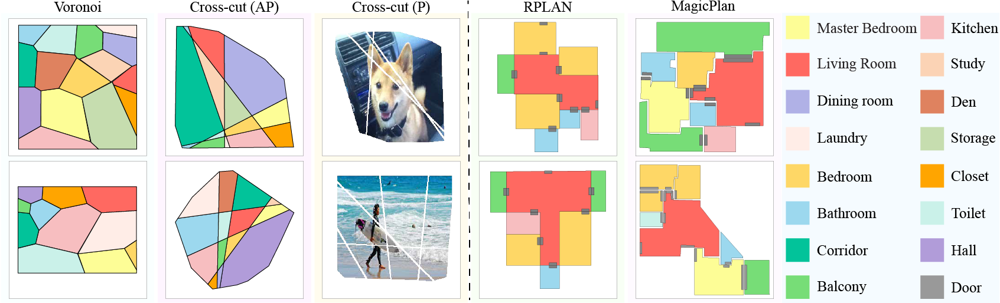

# PuzzleFussion
This includes an original implementation ofour paper:
[Puzzlefusion: Unleashing the Power of Diffusion Models for Spatial Puzzle Solving](https://arxiv.org/pdf/2211.13785.pdf), NeurIPS 2023.

***Further details, instructions on code and along with datasets will be published shortly.***
